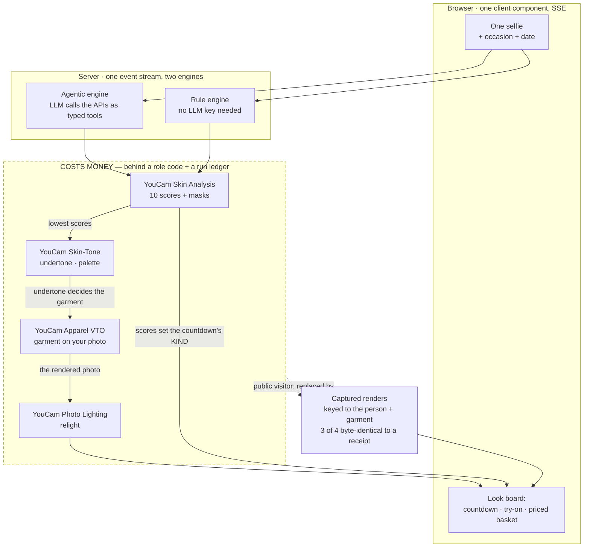

# Aphrodite

I built Aphrodite for Perfect Corp's [YouCam API Skin AI & Apparel VTO Hackathon](https://youcam-api.devpost.com/). The idea is simple: you tell it the occasion, share one selfie, and it reads your skin and coloring, plans a prep countdown timed to the day, renders the outfit onto you, and hands you one shoppable look board.

Most virtual try-on demos stop at "here's a garment on you." I wanted the thing I actually want before a wedding or an interview — *what do I do with my skin between now and the day, what should I wear for my coloring, and where do I buy all of it* — answered in one place, from a single photo.

## Try it — nothing to install

**→ https://aphrodite.max-gutowski.de** — open, no signup, no key, **zero YouCam API units per visit**. Pick the bundled "Wedding · full-body" sample and the full loop finishes in about 4.5 seconds.

| | |
|---|---|
| **4** YouCam APIs chained in one run, each with a **committed receipt** | Skin Analysis → Skin-Tone → Apparel Try-On → Photo Lighting. Every render in demo mode is a real capture of the face it is shown on — `hackathon/receipts/` carries the provider's own task ids and hashes |
| **~4.5 s** end to end | measured on the hosted instance, fixture-served |
| **117** tests in 12 files | `npm test`, measured 2026-08-12; `tsc` / `lint` / `build` also green |
| **0** API units to look | every publicly reachable path is fixture-served, and the page says so |
| **11 / 17** catalogue | garments / skincare SKUs, cross-checkable at [`/healthz`](https://aphrodite.max-gutowski.de/healthz) |

What you see there are **captured YouCam renders**, not live ones, and the page states that in the announcement bar and again in the provenance ledger. Live renders and the LLM engine sit behind an access code, because both spend money — see [Judge mode](#judge-mode). Every number above resolves to a measurement in [`hackathon/CLAIM_PROOF_MAP.md`](hackathon/CLAIM_PROOF_MAP.md).

## What it does

- **Reads you with YouCam AI.** Skin Analysis (0–100 health scores — I focus the lowest ones), Facial Color / Skin Tone (I derive your undertone and a palette from the colors it detects), Apparel Try-On (the outfit rendered onto your photo), and AI Photo Lighting (a camera-ready finish on the selfie).
- **Plans the occasion.** A skincare countdown that changes in *kind* with how far off the event is — weeks out it front-loads active ingredients and tapers them; a day out it stops new actives and switches to hydration and de-puffing, so nothing flares on the day.
- **Dresses you for your coloring, and asks before it assumes.** Your undertone drives the outfit pick — a cool read leans to cool-flattering pieces — and the garment is rendered on you, not just described. Which *cut* you want is a question the app asks outright, and it overrides the colour match when the two conflict; see [Asking instead of assuming](#asking-instead-of-assuming).
- **Completes the look.** One cross-category, priced basket — skincare + the garment + matched accessories — with an on-screen ledger of exactly which YouCam APIs produced each result.
- **Keeps going.** Save an image-free plan (no photo, mask, or raw API response is stored) and come back for a glow check-in that compares your scores to your saved run. A studio for hair color, hairstyle, and makeup on the same selfie is wired but **not shipped** — see [What is wired versus what renders](#what-is-wired-versus-what-renders).

## What is wired versus what renders

One honest sentence instead of three different API counts: **8 endpoints are declared, 7 have a calling module, 5 slugs are verified against the live API, and 4 render on every run.**

| Endpoint | Calling module | Slug verified | Renders today |
|---|---|---|---|
| Skin Analysis | yes | yes (2026-07-19) | **yes** |
| Skin-Tone / Facial Color | yes | yes (2026-07-19) | **yes** |
| Apparel Try-On (`cloth-v3`) | yes | yes (2026-07-19) | **yes** |
| AI Photo Lighting | yes | yes (2026-07-19) | **yes** |
| AI Hair Color | yes | yes (2026-07-24) | no — no captured fixture |
| AI Makeup | yes | **no** — the key 401s on this feature | no |
| AI Hairstyle | yes | **no** — the key 401s on this feature | no |
| `look-vto` | **no call site** | — | no |

The last four are why the studio tiles return an honest empty state rather than an image. `/healthz` reports the declared figure as `youcam_apis_wired: 8`; the number to judge the product on is **4**.

## The chain, and where the trust boundary sits

One diagram, because the differentiator here is architectural and a judge should not
have to reconstruct it from prose. Solid arrows are data actually flowing; the dashed
box is everything that costs money, and it is closed to the public by default.



**Read the two edges that matter.** `S → C → V` is the fused chain the special
category asks for: the skin read produces the undertone, and the undertone is one of
the weighted factors that picks the garment that gets rendered — the board prints
those factors, including the runs where the undertone was *outweighed* by occasion
formality. And `gated -.-> F` is the honesty boundary: an anonymous visitor never
crosses into the paid box, so what they see are captured renders, each one keyed to
the face it belongs to, and the page says so in the announcement bar and the
provenance ledger.

## Two engines, one stream

There are two ways to run the concierge, and they emit the *same* event stream, so the interface doesn't care which one drove the run:

- **Agentic** — Claude (or GPT) orchestrates the YouCam APIs by reasoning over your scores and calling them through typed REST function-calling tools. Needs an LLM key.
- **Guided** — a rule engine that produces the same board with no LLM at all. Runs on the YouCam key alone.

I did it this way on purpose: the app works with just a YouCam key, and the agentic engine is a pure upgrade on top of it.

## Getting started

The quickest way to see it is **demo mode** — captured sample renders, no keys, and zero API units spent:

```bash
git clone https://github.com/Lockelamoree/aphrodite
cd aphrodite
npm install
cp .env.example .env.local     # demo mode (YOUCAM_FIXTURES=1) is already set
npm run dev                    # http://localhost:3000
```

That runs the whole flow — plan, try-on, refinement, save and check-in — against pre-recorded YouCam outputs, and the UI labels itself *"demo mode · sample renders"* so nothing over-claims.

To run it live on your own photo, add a YouCam key and turn fixtures off in `.env.local`:

```bash
YOUCAM_API_KEY=your_key        # free tier: https://yce.perfectcorp.com/api-console
YOUCAM_FIXTURES=0
```

Add an `ANTHROPIC_API_KEY` (or `OPENAI_API_KEY`) to unlock the agentic engine — the app detects the key on the server and switches the toggle on for you.

| Var | Purpose |
|---|---|
| `YOUCAM_API_KEY` | YouCam / Perfect Corp API key (required for live renders) |
| `YOUCAM_FIXTURES` | `1` = demo mode, zero units (default); `0` = live renders |
| `ANTHROPIC_API_KEY` | Agentic engine, Claude brain (optional; preferred when both are set) |
| `OPENAI_API_KEY` | Agentic engine, GPT brain (optional; `OPENAI_MODEL` overrides the default) |

## Built for retail

Aphrodite is meant to drop into a beauty or fashion retailer's own funnel:

- The whole experience is one streamed route plus one client component, themeable through the Tailwind tokens in `app/globals.css` — swap the palette to a brand in one place.
- Garments, skincare, and accessories live in `lib/concierge/catalog.ts` with price / retailer / URL fields. Point them at real products and the "shop the look" basket becomes a live storefront.
- Every board is a priced, cross-category basket with a provenance ledger, and the outfit is rendered on the shopper *before* they buy — the try-before-you-buy pattern Perfect Corp makes the conversion-and-fewer-returns case for.

The demo catalog and its "shop" links are clearly labelled sample inventory (the links are product searches), not a real store.

## Asking instead of assuming

Aphrodite asks you to pick a cut — feminine or masculine — before the first run, and
there is deliberately no "either / no preference" option.

That is not an oversight, it is the fix for a real bug. Presentation is not something
to guess from a photograph, so the app never looks at your face to decide it. But an
unset value is a guess too: the demo catalogue holds nine feminine cuts to one
masculine and one neutral, so anything that failed to state a cut resolved feminine
in practice. It did exactly that — the bundled masculine sample was being rendered in
an evening gown, with statement earrings and heels in the basket, because the cut
filter only ran on the grooming track and a tie-breaker leaned away from suits.

So the question is asked once, in one tap, and the answer is enforced on every code
path and in both engines. `tests/cutPreference.test.ts` guards it, and it also pins
the catalogue's 9:1:1 shape so that widening the wardrobe trips the test rather than
quietly changing behaviour.

The honest limit: there is currently **one** masculine garment, so a masculine
shopper has no smart or casual option and no warm-toned one. The app declines to
claim a colour match it cannot make, rather than inventing one.

## Judge mode

Aphrodite is fully usable with no code at all — you get captured sample renders
instead of live ones, at zero API cost, and the page says so in the announcement
bar and again in the provenance ledger. What an access code unlocks is only the two
paths that spend money: real YouCam renders, and the LLM-driven engine.

Two schranken, not one, because a code answers *who* may spend and not *how many
times*. The YouCam free tier is finite and one full run costs four to five API
tasks, so unlocked runs are metered by a ledger. When the budget is gone the app
keeps working and states on screen that it fell back to captured samples — it never
passes one off as the other. `/healthz` reports `live_runs_used` and
`live_runs_budget` so the meter is checkable from outside.

A code is redeemed at **https://aphrodite.max-gutowski.de/unlock** and becomes a
12-hour `HttpOnly` cookie. The judging code is published in the Devpost submission's
testing field, not here — a code committed to a public repo would be no gate at all.

The gate switches itself on only when both `APHRODITE_LIVE_CODES` and
`APHRODITE_AUTH_SECRET` are set. Nothing configured means nothing to withhold,
which is what keeps local development and the test suite ungated without a single
special case in the code.

## Check it yourself

`GET /healthz` reports state, not liveness — no key required, and it works on the hosted instance:

```bash
curl -s https://aphrodite.max-gutowski.de/healthz    # the instance a judge visits
curl -s http://localhost:3000/healthz               # a local run
```

It returns the deployed revision, whether demo mode is on, the headline counts read
from the loaded catalogue (so this README, the submission copy and the running system
can be checked against each other), and a **three-state** answer per model-backed
feature: `live`, `off`, or `key_present_unverified`. That middle state is the point —
a key that is present but rejected, exhausted, or aimed at a model the account cannot
see looks configured while nothing is actually happening.

The LLM probe is a `GET /v1/models` call, so a health check never costs money. YouCam
is deliberately *not* probed, because every YouCam task call spends units from a
finite tier.

### The API evidence, without spending anything

`GET /api/dev/verify` answers the question a judge cannot otherwise settle: does this
project really talk to Perfect Corp, and what does the wire look like?

It has two modes, split by what they **cost**:

| Request | What it does | Units |
|---|---|---|
| `/api/dev/verify` | replays the pinned request/response contract, transcribed from receipts committed under `hackathon/receipts/` — the four-step call sequence, real `task_id`s, the sha256 and byte count of the images YouCam returned, and the terminal poll envelopes **including the two tasks that failed** | **0** |
| `/api/dev/verify?spend=1&image=<https url>` | makes real calls, metered by the same ledger as the product and refused when the budget is out | 1 per step |

Both sit behind the role code redeemed at `/unlock` whenever the gate is configured;
with no gate configured, local development and CI reach them freely. The free mode is
the one that matters for judging: it is refreshable, it names the failures, and
`tests/verify-route.test.ts` fails the suite if that path ever touches the network or
if a pinned row stops matching the receipt it claims to come from.

The route used to `404` in production, on purpose — it was born as a live harness, and
a live harness open on the internet is a money leak. Splitting it by cost is what made
the evidence reachable without making a page refresh expensive.

## Honesty and privacy

This is a hackathon entry, and being straight with the user matters to me. The app never passes a sample render off as a live one; the before/after only ever shows real YouCam output; the saved plan keeps no image or raw API data; image processing sits behind an explicit consent step; and every bit of skin guidance is cosmetic, not medical.

**A render is a claim about whose face is in it.** So in demo mode every captured
render is keyed to the person it actually depicts — by content fingerprint — and to the
garment it actually shows. Two such renders exist, and for every other photo or garment
the app says no captured render exists rather than substituting one. That rule was
written the hard way: three of the four render fixtures turned out to depict three
different people, and one of them carried the look board as its hero under the caption
"Occasion lighting · rendered by YouCam AI". For a while the consequence was visible and deliberate — the ledger named **three** APIs
instead of four, because no relight of that face had been captured. On 2026-08-12 that
relight was captured (`hackathon/receipts/002`), so the sample path names four again,
each one behind a render of the face it is shown on. Three of those four renders are
byte-identical to a committed receipt; the fourth, the landing hero's try-on, was
captured in July before the receipt harness existed and says so rather than borrowing a
receipt it does not match.

## Testing

```bash
npm test
```

**117 tests in 12 files, all passing** (measured 2026-08-12). Vitest covers occasion parsing, the catalog and garment selection (including guards against mis-gendered styling), the cut preference and the catalogue's 9:1:1 shape, the access gate, the provenance ledger, request validation, rate limiting, stripping raw provider fields out of the stream, and the evidence route — including an assertion that its free mode reaches no network at all, and one that every row of the pinned API contract still matches the receipt it was transcribed from. The API route validates the request body (zod), caps payload size, and rate-limits per IP.

The four gates this project holds itself to, all green as of 2026-08-10:

```bash
npx tsc --noEmit && npm test && npm run lint && npm run build
```

## Stack

Next.js 16 · React 19 · TypeScript · Tailwind v4 · Anthropic SDK · OpenAI · Zod · Vitest · YouCam (Perfect Corp) AI API.

## License

MIT — see [LICENSE](LICENSE).
